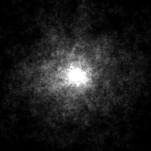
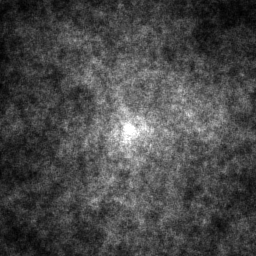
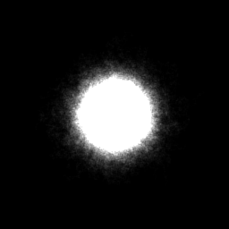

# Random walk 

Generates image by random walk.

Usage (default values in square brackets, just use numbers):
```
./RandomWalker [resolution=256] [lifetime=10000] [particle count=200]
```

Dependencies:
- [{fmt}](https://github.com/fmtlib/fmt) - better printing utilities


*1. Image generated with default settings*


*2. Image generated with lifetime=100000 and count=100*


*3. Image generated with lifetime=1000 and count=100000*
